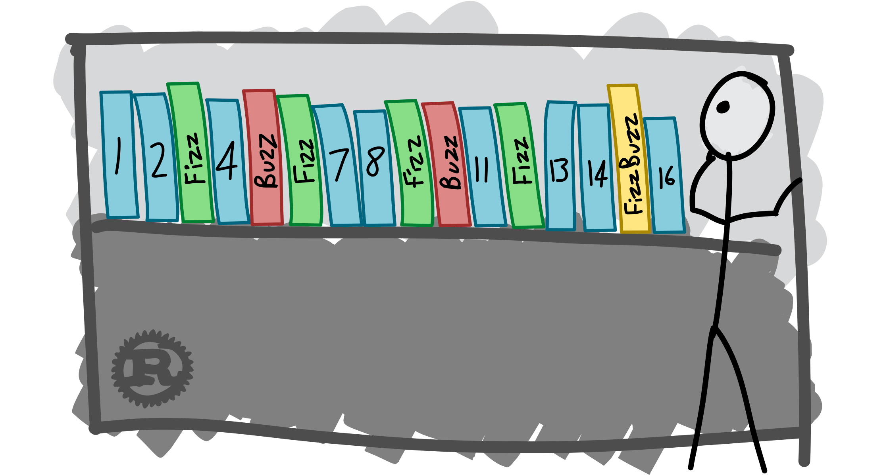

  [![Contributors][contributors-shield]][contributors-url] [![Forks][forks-shield]][forks-url] [![Stargazers][stars-shield]][stars-url] [![Issues][issues-shield]][issues-url] [![MIT License][license-shield]][license-url] [![LinkedIn][linkedin-shield]][linkedin-url]

<!-- PROJECT LOGO -->
<br />

<p align="center">
  <a href="https://github.com/vineeths96/FizzBuzz">
    
  </a>
  <h3 align="center">FizzBuzz</h3>
  <p align="center">
    FizzBuzz 
    <br />
    <a href=https://github.com/vineeths96/FizzBuzz><strong>Explore the repository»</strong></a>
    <br />
    <br />
    <a href=https://github.com/vineeths96/FizzBuzz/blob/master/results/Project1.pdf>View Problem Statement</a>
    <a href=https://github.com/vineeths96/FizzBuzz/blob/master/results/Deep_Learning_Report_1.pdf>View Report</a>
  </p>


</p>

> tags : fizzbuzz, python, deep learning, tensorflow


<!-- ABOUT THE PROJECT -->
## About The Project

This project is an implementation of the simple task of FizzBuzz. In this task, an integer divisible by 3 is printed as Fizz, and integer divisible by 5 is printed as Buzz. An integer divisible by both 3 and 5 is printed as FizzBuzz. The following methods were implemented and the performance was evaluated. 

* if-then-else logic
* Deep model classifier

### Built With
This project was built with 

* python v3.7
* tensorflow v2.1
* The list of libraries used for developing this project is available at [requirements.txt](requirements.txt).


<!-- GETTING STARTED -->

## Getting Started

Clone the repository into a local machine using

```shell
git clone https://github.com/vineeths96/FizzBuzz
```

### Prerequisites

Please install required libraries by running the following command (preferably within a virtual environment).

```shell
pip install -r requirements.txt
```

The training dataset for the deep model is generated on-the-fly. No prior setup is neccesary.

### Instructions to run

The `main.py` is the interface to the program. It is programmed to run in two modes – train mode and test mode. The `main.py` file takes one optional command line argument, to specify the mode of execution – whether to train or test model. The `main.py`, when executed without any arguments enters into training the deep model. The `main.py`, when executed with `–test-data <test_file>` argument (where `test_file` is the path to the test file), enters into testing the deep model, and produces the output files `Software1.0.txt` and `Software2.0.txt` respectively.

##### Train mode

```shell
python main.py
```

##### Test mode

```shell
python main.py -–test-data <test_file>
```


<!-- RESULTS -->

## Results

Detailed discussions on results can be found in the report [here](./Deep_Learning_Report_1.pdf).

|     **Model**      | **Accuracy** |
| :----------------: | :----------: |
| if-then-else logic |     100%     |
| Deep network model |     98%      |


<!-- LICENSE -->

## License

Distributed under the MIT License. See `LICENSE` for more information.


<!-- CONTACT -->
## Contact

Vineeth S - vs96codes@gmail.com

Project Link: [https://github.com/vineeths96/FizzBuzz](https://github.com/vineeths96/FizzBuzz)


<!-- MARKDOWN LINKS & IMAGES -->
<!-- https://www.markdownguide.org/basic-syntax/#reference-style-links -->

[contributors-shield]: https://img.shields.io/github/contributors/vineeths96/FizzBuzz.svg?style=flat-square
[contributors-url]: https://github.com/vineeths96/FizzBuzz/graphs/contributors
[forks-shield]: https://img.shields.io/github/forks/vineeths96/FizzBuzz.svg?style=flat-square
[forks-url]: https://github.com/vineeths96/FizzBuzz/network/members
[stars-shield]: https://img.shields.io/github/stars/vineeths96/FizzBuzz.svg?style=flat-square
[stars-url]: https://github.com/vineeths96/FizzBuzz/stargazers
[issues-shield]: https://img.shields.io/github/issues/vineeths96/FizzBuzz.svg?style=flat-square
[issues-url]: https://github.com/vineeths96/FizzBuzz/issues
[license-shield]: https://img.shields.io/badge/License-MIT-yellow.svg
[license-url]: https://github.com/vineeths96/FizzBuzz/blob/master/LICENSE
[linkedin-shield]: https://img.shields.io/badge/-LinkedIn-black.svg?style=flat-square&logo=linkedin&colorB=555
[linkedin-url]: https://linkedin.com/in/vineeths

